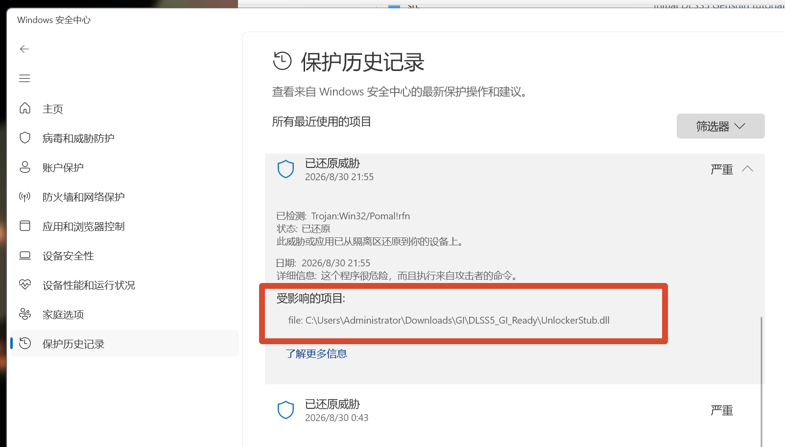
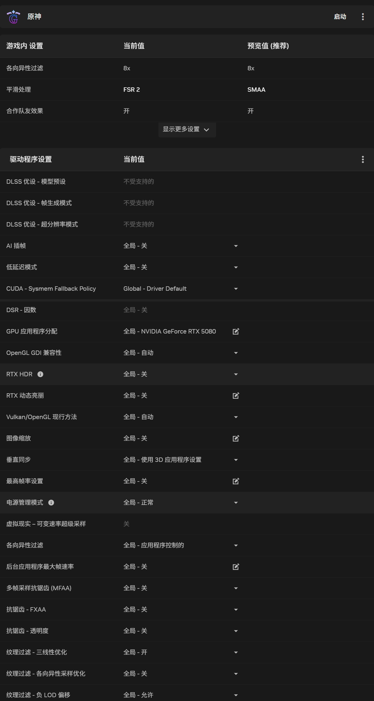
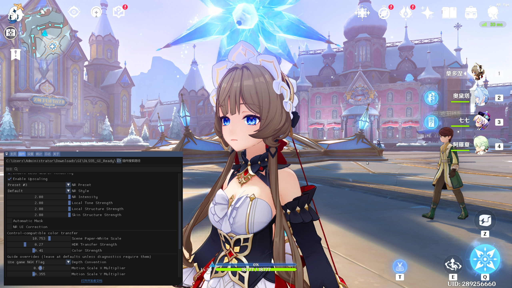
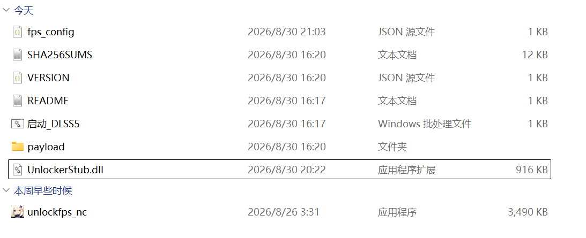

# 原神 DLSS5 一键包

1. 下载完整文件夹包，放到任意英文路径。
2. 只双击 `启动_DLSS5.bat`。
3. 第一次选择 `YuanShen.exe`，以后再次双击即可。

压缩包已包含运行所需组件：ReShade、OptiScaler、FSR Bridge、DLSS5 bridge、RenoDX、FPS Unlocker，以及 `nvngx_dlss.dll` 和 `nvngx_dlssnr.dll`。只需运行批处理文件，不需要打开 `.ps1`，也不需要改名 `dxgi.dll`/`d3d12.dll`。

HDR 也已包含并默认启用：启动器会设置原神的 HDR 开关，包内带有 RenoDX 和 HDR shader。要看到真实 HDR 输出，还需要在 Windows 和显示器上开启 HDR；ReShade shader 只是随包提供，不会自动启用每一个效果。

## 最新版本：v1.1

推荐下载 v1.1：已修复此前 RenoDX DLSS5 插件的显存泄漏问题，并更新 DLSS5/NR 模型组件。

- [Google Drive 下载](https://drive.google.com/file/d/17LIscmrEGhJrlWnOdZNlRBFJotdHaOLf/view?usp=sharing)（不限速）
- [百度网盘下载](https://pan.baidu.com/s/1tlxdX8iLNN9gCvEd5j2soQ?pwd=y95x)（国内访问方便，建议使用 SVIP 下载）

百度网盘提取码：`y95x`；7z 解压密码：`yuanshenqidong`。

如果解压后缺少 `UnlockerStub.dll`，请从 [GitHub 单独下载](https://github.com/CXP-2024/dlss5_for_genshinimpact/raw/refs/heads/main/release/fps-unlocker/UnlockerStub.dll)，放到解压包根目录，与 `启动_DLSS5.bat`、`unlockfps_nc.exe` 同级。只需补放这个文件，不要改名。

## 启动时未成功加载DLSS5可能原因

1. 检查是否插件被windows拦截了，具体按在win键，搜索安全，进入到windows安全中心，找到如下页面是否把UnlockerStub.dll给拦截了，需要允许其使用这个程序

2. 检查驱动是否为新版，目前已验证版本610.88可以正常启动使用
3. 不要开启nvidai app里面的插帧功能，且原神的抗锯齿使用FSR2, 因为我们通过这个接口转成DLSS算法抗锯齿。进入游戏后可以试着调一下渲染倍率，其中倍率0.999相当于DLAA。

## DLSS5刚进入时可能会有屏幕闪烁

这是正常的，大概率是参数没有调好，可以自行配一下

## 解压后的目录

解压完成后，根目录应类似下图：

## 工作原理

原神本身是 DX11，DLSS5 插件需要 DX12 的 NGX 调用。启动器按固定顺序注入 ReShade、`Dx11FsrBridge.dll` 和 `OptiScaler.dll`：

1. Bridge 从 DX11 游戏帧中取得颜色、深度和运动向量，并建立一个内部 DX12 会话。
2. OptiScaler 提供 DLSS4 兼容入口；DLSS5 bridge 将这次 DX12 NGX 调用交给 `nvngx_dlssnr.dll` 和 RenoDX DLSS5 插件。
3. 神经渲染完成后，结果同步并复制回原神的 DX11 输出。

脚本每次启动都会把 ReShade 的 `AddonPath`、Shader 路径和 OptiScaler 路径改为压缩包当前位置。

桥接插件还修复了启动崩溃：ReShade 可能会二次包装 Bridge 自建的 DX12 设备，造成虚表冲突。修复版在创建内部设备时临时绕过 ReShade 的设备 hook，并先还原原生 adapter，再恢复 hook；不修改系统 DLL。

GitHub 只保存源码和小型 release 文件；组件授权与重新分发注意事项见 `docs/REDISTRIBUTION.md`。

## 引用的开源项目

- [Genshin FSR Bridge](https://github.com/AizawaHikaru233/genshin_fsr_brigde)：拦截原神 DX11 的 FSR2 调用，准备颜色、深度和运动向量，并把超分请求转交给 OptiScaler。这里使用它的 `Dx11FsrBridge.dll` 作为 DX11 输入桥接；本项目没有改写其核心 FSR 算法，只调整了组件目录和加载顺序。
- [DLSS5 DX11 Bridge](https://github.com/NIGos/dlss5-dx11-bridge)：把 DX11 的 NGX 请求复制到自建 DX12 会话，使 DLSS5 Neural Rendering 插件能够接收到调用，再将结果复制回游戏输出。本项目基于其源码编译，并增加 ReShade 二次包装 D3D12 设备的兼容处理：创建内部设备时临时绕过 `D3D12CreateDevice` hook、还原原生 adapter，随后恢复 hook；具体见 [`LOCAL-CHANGES.md`](src/dlss5-dx11-bridge/LOCAL-CHANGES.md)。
- [Genshin FPS Unlock](https://github.com/34736384/genshin-fps-unlock)：通过外部进程写入游戏帧率参数并启动游戏。本项目未改动其解锁算法，只将 `unlockfps_nc.exe`、`UnlockerStub.dll` 和配置写入流程整合进一键包。

三个项目的组合关系是：FSR Bridge 提供 DX11 的输入资源，OptiScaler 提供 DLSS4 兼容入口，DLSS5 DX11 Bridge 将请求转入 DLSS5，FPS Unlocker 负责按配置启动并解锁帧率。
