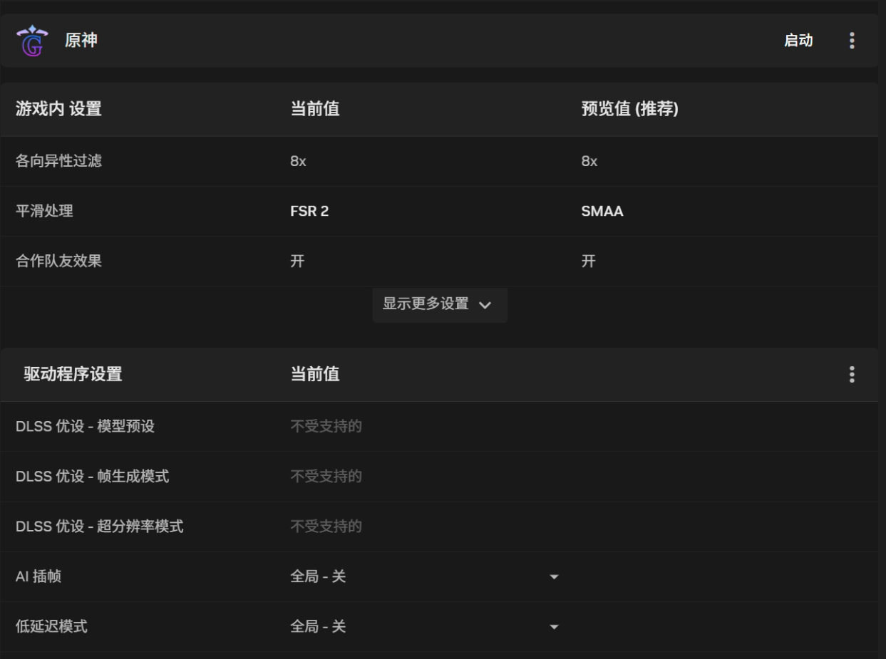
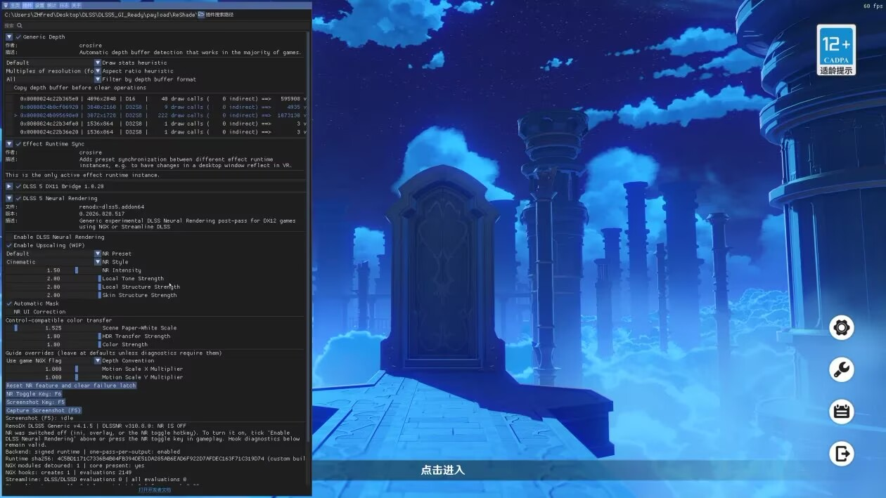
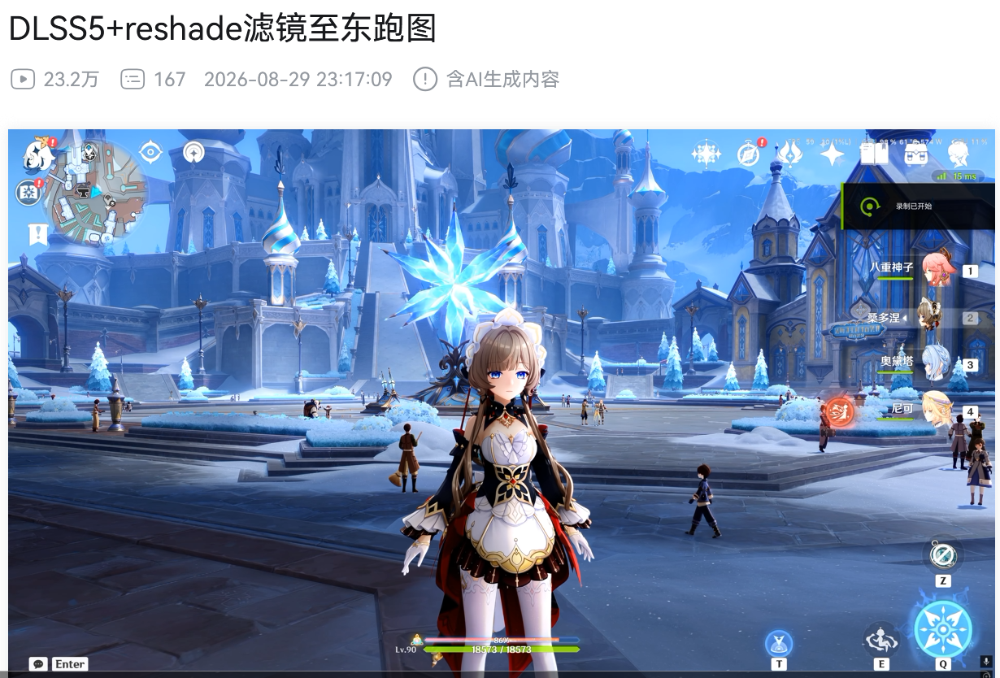

# 原神 DLSS5 一键包

## 目录

- [v1.1 与 v1.2（按需选择）](#v11-与-v12按需选择)
- [v1.1 后置 NR 版](#v11后置-nr-版有问题进q-1107530312-联系)
- [v1.2 前置 NR 超分版](#v12前置-nr-超分版)
- [RTX 40 系列专用 DLSS NR 模型](#rtx-40-系列专用-dlss-nr-模型)
- [失败排查！！！一定要看！一定要看！一定要看！！！](#报错闪退-进不去原神-进去了画面未生效可能原因)
- [屏幕闪烁说明](#dlss5刚进入时可能会有屏幕闪烁)
- [调参示例](#调参示例源于b站up主zhfred)
- [解压后的目录](#解压后的目录)
- [工作原理以及 v1.1/v1.2 的区别](#工作原理以及-v11v12-的区别)
- [引用的开源项目](#引用的开源项目)
- [一键包组件来源与替换说明](#一键包组件来源与替换说明)
- [旧版本 v1.0](#旧版本v10)

1. 务必下载完整文件夹包，并将其放到任意 **英文路径下。不要放在带有中文路径或者空格的路径下**
2. 只双击 `启动_DLSS5.bat`。
3. 第一次选择 `YuanShen.exe`，以后再次双击即可。
4. 如果不成功，请看[失败排查！！！一定要看！一定要看！一定要看！！！](#报错闪退-进不去原神-进去了画面未生效可能原因)

两个完整包都已经包含各自运行所需组件，不需要提前安装 GIMI、ReShade、OptiScaler、DLSS DLL 或 FPS Unlocker。v1.1 包含原来的 DLSS5 bridge/RenoDX 后置 NR 链路；v1.2 改用前置 NR 插件与经过兼容修改的 OptiScaler。只需运行批处理文件，不需要打开 `.ps1`，也不需要改名 `dxgi.dll`/`d3d12.dll`。

HDR 也已包含并默认启用：启动器会设置原神的 HDR 开关，包内带有 RenoDX/HDR 相关处理和 shader。要看到真实 HDR 输出，还需要在 Windows 和显示器上开启 HDR；ReShade shader 只是随包提供，不会自动启用每一个效果。

## v1.1 与 v1.2（按需选择）

v1.1 和 v1.2 是两个并列版本，请按需要选择并放在相互独立的文件夹内，不要把两个版本的 `payload` 或 Add-ons 相互覆盖。

| 版本 | DLSS5 NR 的位置 | 适合人群 | 当前显卡范围 |
| --- | --- | --- | --- |
| v1.1 后置 NR 版 | 原始 DLSS 已经得到输出帧后，再在输出分辨率执行 NR；NR 本身不承担低分辨率超分 | 希望保留原来效果，或不需要 v1.2“低分辨率 NR 后再超分”的用户 | RTX 50；RTX 40, 30 按下文替换专用 NR 模型 |
| v1.2 前置 NR 超分版 | 先在低渲染分辨率执行 DLSS5 NR，再由原始 DLSS Super Resolution 放大到输出分辨率 | 希望降低 NR 工作分辨率、使用新版前置超分链路的用户 | 当前完整包只验证 RTX 50，40系请自行尝试 |

## v1.1：后置 NR 版（有问题进q 1107530312 联系）

v1.1 已修复此前 RenoDX DLSS5 插件的显存泄漏问题，并更新 DLSS5/NR 模型组件。支持 50 系显卡。这一版继续保留给不需要 v1.2 前置 NR 超分的用户。

[失败排查！！！一定要看！一定要看！一定要看！！！](#报错闪退-进不去原神-进去了画面未生效可能原因)

- [Google Drive 下载](https://drive.google.com/file/d/17LIscmrEGhJrlWnOdZNlRBFJotdHaOLf/view?usp=sharing)（不限速）
- [百度网盘下载](https://pan.baidu.com/s/1tlxdX8iLNN9gCvEd5j2soQ?pwd=y95x)（国内访问方便，建议使用 SVIP 下载）

百度网盘提取码：`y95x`；7z 解压密码：`yuanshenqidong`。

## v1.2：前置 NR 超分版

v1.2 把 DLSS5 Neural Rendering 放到低分辨率阶段，然后把 NR 结果交给原始 DLSS Super Resolution 放大。它不是在原分辨率跑完 NR 后再缩放。实测链路为 `960x540 NR -> 960x540 -> DLSS -> 1920x1080`，Feature 18 连续成功 5400 帧，测试段约 160 FPS。

- [Google Drive 下载](https://drive.google.com/file/d/1u6WCgz7SPKxeKIclsioQiCopEP2IckCY/view?usp=sharing)（海外/不限速）
- [百度网盘下载](https://pan.baidu.com/s/1nuIAeIADuH9SIkNnhgeKRQ?pwd=95ft)（国内访问，提取码：`95ft`）
- 文件名：`DLSS5_GI_Ready_v1.2_PreNR_RTX50_20260904.7z`
- 文件大小：`166,978,690 bytes`（约 159.2 MiB）
- SHA-256：`BB0EF3E89BF37BC018DC6CA872590913AECE8FF37A672B84B76DC72EB4014F1F`
- 7z 解压密码：`yuanshenqidong`
- 7z 已启用 AES 内容加密与文件名加密，密码错误时无法查看目录结构

v1.2 当前完整包只验证 RTX 50。RTX 40,30系可自行尝试。

### RTX 40，30 系列专用 DLSS NR 模型

以下替换方法用于 v1.1, v1.2版本请自行尝试，暂时未验证。如果显卡是 RTX 40 或30 系列，请额外下载 RHI 提供的 RTX40或30 专用 `nvngx_dlssnr.dll`，不要直接使用 v1.1 完整包内的默认 NR 模型：

- [Google Drive 下载](https://drive.google.com/file/d/1ijpMYWjmfPUvOvtoST1xHB73ZXPNlAyq/view?usp=sharing)
- [百度网盘下载](https://pan.baidu.com/s/1GSp99MEpuf7BaDbueYqmlA?pwd=ycsu)（提取码：`ycsu`）
解压后，用其中的 `nvngx_dlssnr.dll` 替换：

```text
DLSS5_GI_Ready\payload\ReShade\reshade-shaders\Addons\nvngx_dlssnr.dll
```

只替换这个文件，其余插件均保持不变。v1.2 使用不同目录和前置链路，目前没有验证 RTX 40,30 替换方案。

## 报错闪退-进不去原神-进去了画面未生效可能原因

1. 请确保自己的系统是window11 24H及以上系统， 如不是请更新系统至最新（win10请升级至win11）。请确保你的显卡是Nvidia显卡的30，40系或者50系。请确保你使用的压缩包来源与此处的Google云盘或者百度网盘链接一致。请确保解压后放到任意 **英文路径下**，不要放在带有中文或者空格或者特殊字符的路径下*
2. 请在第一次启动前删除或卸载除当前压缩包以外的所有你安装过的第三方内容（如第三方游戏目录注入式启动器，Reshade组件，RHI组件等等），保证游戏目录文件夹处于干净状态，防止与DLSS5启动冲突。
3. 首先关闭你的所有杀毒软件，包括但不限于毒枭360，毒王电脑管家，毒霸金山... 其次检查是否插件被windows拦截了，具体按在win键，搜索安全，进入到windows安全中心，找到如下页面是否把UnlockerStub.dll给拦截了，需要允许其使用这个程序

4. 检查驱动是否为新版，目前已验证版本610.88可以正常启动使用v1.1, 616.56可以使用v1.2，更高的版本兼容性更强，所以推荐更新到最新
5. 检查帧率限制是否已经被解除，如果没有，请务必在系统托盘中退出unlockfps_nc这个程序，然后重新双击启动DLSS5
6. 尽量不要把原神安装在系统盘的Program Files 目录，启动可能会有权限问题，可尝试使用管理员权限启动DLSS5, 或者将原神本体安装在根盘或者其它数据盘内。
7. 不要开启nvidai app里面的插帧功能！！！且原神内部的抗锯齿选项请使用FSR2！！！因为我们通过这个接口转成DLSS算法抗锯齿。进入游戏后可以试着调一下渲染倍率，其中倍率0.999相当于DLAA，0.2 就是超级性能档的DLSS. 关闭垂直同步，关闭动态模糊，关闭角色动态高精度。
8. 最后，请尝试重启游戏，重启系统看看是否解决。


补充说明：如果解帧状态异常，请先在系统托盘退出 `unlockfps_nc` 后重新启动；仍然异常时重启系统。HDR 下插件内置截图可能呈灰色或色彩偏差，验证画面建议优先使用系统截图工具。

## DLSS5刚进入时可能会有屏幕闪烁

这是正常的，大概率是参数没有调好，可以自行配一下


## 调参示例源于b站up主ZHFred



## 解压后的目录

解压完成后，根目录应类似下图：


## 工作原理以及 v1.1/v1.2 的区别

原神本身是 DX11，而 DLSS5 插件需要 DX12 NGX 调用。两个版本都会通过启动器按固定顺序注入 ReShade、`Dx11FsrBridge.dll` 和 `OptiScaler.dll`，但 NR 插入点不同。

### v1.1 后置 NR 链路

```text
原神 DX11 低分辨率颜色 / 深度 / 运动向量
  -> Dx11FsrBridge 与 OptiScaler 提供 DLSS 兼容入口
  -> 原始 DLSS 得到游戏输出帧
  -> DLSS5 DX11 Bridge 转入私有 DX12 NGX 会话
  -> RenoDX / DLSS5 Add-on 在输出分辨率执行 Neural Rendering
  -> 结果复制回 DX11
  -> ReShade / UI
```

v1.1 的 NR 位于原始 DLSS 输出之后。它适合希望保留原方案，或者不需要把 NR 放到低渲染分辨率再超分的用户。旧桥接插件还处理了 ReShade 二次包装自建 D3D12 设备造成的启动冲突：创建内部设备时临时绕过 ReShade 的设备 hook、还原原生 adapter，随后恢复 hook；不修改系统 DLL。

### v1.2 前置 NR 超分链路

```text
原神 DX11 低分辨率颜色 / 深度 / 运动向量
  -> Dx11FsrBridge 捕获 FSR2 输入
  -> OptiScaler dlss_12 创建私有 DX12 NGX 会话
  -> 前置 NR Add-on 以 Feature 18 在渲染分辨率执行 Neural Rendering
  -> 原始 DLSS Feature 1 从渲染分辨率放大到输出分辨率
  -> 结果复制回 DX11
  -> ReShade / UI
```

v1.2 不加载 v1.1 的 `dlss5-dx11-bridge` 与 RenoDX 后置 NR Add-on，并关闭 OptiScaler 内置后置 NR，确保每帧只执行一次前置 NR。它包含两项针对无 GIMI 路径的 OptiScaler 兼容修复：

1. 在 `dlss_12` 路径延迟原生 D3D11 NGX 初始化，改用 OptiScaler 参数表交接 D3D12 颜色、深度、运动向量和输出资源，再由 D3D12 Feature 初始化原生 NGX。
2. 创建私有 DLSS-on-DX12 设备时解包 ReShade adapter，并只在创建调用期间临时绕过 `D3D12CreateDevice` detour，完成后立即恢复；不修改系统 DLL。

脚本每次启动都会把 ReShade 的 `AddonPath`、Shader 路径和 OptiScaler 路径改为压缩包当前位置。GitHub 只保存源码、补丁和小型 release 文件；完整运行包与大型 NVIDIA DLL 不放入 Git 历史。v1.2 对应源码补丁见 [`src/patches/OptiScaler-DLSSOn12-pre-NR.patch`](src/patches/OptiScaler-DLSSOn12-pre-NR.patch)。

## 引用的开源项目

- [Genshin FSR Bridge](https://github.com/AizawaHikaru233/genshin_fsr_brigde)：拦截原神 DX11 的 FSR2 调用，准备颜色、深度和运动向量，并把超分请求转交给 OptiScaler。这里使用它的 `Dx11FsrBridge.dll` 作为 DX11 输入桥接；本项目没有改写其核心 FSR 算法，只调整了组件目录和加载顺序。
- [DLSS5 DX11 Bridge](https://github.com/NIGos/dlss5-dx11-bridge)：把 DX11 的 NGX 请求复制到自建 DX12 会话，使 DLSS5 Neural Rendering 插件能够接收到调用，再将结果复制回游戏输出。本项目基于其源码编译，并增加 ReShade 二次包装 D3D12 设备的兼容处理：创建内部设备时临时绕过 `D3D12CreateDevice` hook、还原原生 adapter，随后恢复 hook；具体见 [`LOCAL-CHANGES.md`](src/dlss5-dx11-bridge/LOCAL-CHANGES.md)。
- [Genshin FPS Unlock](https://github.com/34736384/genshin-fps-unlock)：通过外部进程写入游戏帧率参数并启动游戏。本项目未改动其解锁算法，只将 `unlockfps_nc.exe`、`UnlockerStub.dll` 和配置写入流程整合进一键包。

三个项目的组合关系是：FSR Bridge 提供 DX11 的输入资源，OptiScaler 提供 DLSS4 兼容入口，DLSS5 DX11 Bridge 将请求转入 DLSS5，FPS Unlocker 负责按配置启动并解锁帧率。v1.2 不再加载最后一个 DLSS5 DX11 Bridge Add-on，而是在修改版 OptiScaler 的 DLSS-on-DX12 路径上接入前置 NR 插件。

## 一键包组件来源与替换说明

| 组件 | 使用版本 | 来源 | 本项目是否修改 | 能否自行替换 |
| --- | --- | --- | --- | --- |
| `Dx11FsrBridge.dll` | v1.1、v1.2 | [Genshin FSR Bridge](https://github.com/AizawaHikaru233/genshin_fsr_brigde) | v1.2 沿用 v1.1 已验证二进制，本轮未修改 | 可以换成来源可信且接口/配置兼容的同用途构建 |
| `OptiScaler.dll` | v1.1 | [OptiScaler](https://github.com/optiscaler/OptiScaler) / [OptiScaler DLSSNR fork](https://github.com/Dagherbou/OptiScaler_DLSSNR) | v1.1 使用原有版本 | 可以，但必须匹配桥接接口和配置 |
| `OptiScaler.dll` | v1.2 | [OptiScaler DLSSNR fork](https://github.com/Dagherbou/OptiScaler_DLSSNR) | **修改过源码**：加入无 GIMI 参数交接与 ReShade 私有 D3D12 修复 | 不要直接换成普通上游版，否则前置 NR 可能变成 0 帧或启动崩溃；如替换必须自行合入本仓库 patch |
| `dlss5-dx11-bridge.addon64` | 仅 v1.1 | [DLSS5 DX11 Bridge](https://github.com/NIGos/dlss5-dx11-bridge) | **修改过源码**：加入 ReShade/D3D12 兼容处理 | 不建议换成未包含本项目兼容修复的普通版 |
| RenoDX DLSS5 Add-on | 仅 v1.1 | [RenoDX](https://github.com/clshortfuse/renodx) | 本项目没有改写其 NR 算法 | 可以换兼容版本；不要复制到 v1.2 造成双重 NR |
| `nr-before-sr.zh-CN.addon64`、`nrchain_nvngx.dll` | 仅 v1.2 | 用户提供的 `B站野生的装机宅 DLSS5-AI渲染超分版-RTX50.zip`，署名 Bilibili UP 主“野生的装机宅” | 两个二进制**未修改**；只把 `nr_before_sr.ini` 的 Mode 从 1 调成 2 | 二进制可以换兼容版本，但配置必须保持前置 Mode 2，且应保留原作者署名与声明 |
| `nvngx_dlss.dll`、`nvngx_dlssnr.dll` | v1.1、v1.2 | NVIDIA NGX/DLSS 运行时，由相应上游包提供 | 二进制未修改 | 可以从其他可信来源替换兼容版本，但必须匹配显卡代际、驱动、DLSS/NR 接口；RTX 40/50 模型不要混用 |
| `ReShade64.dll` | v1.1、v1.2 | [ReShade](https://reshade.me/) Add-on 版本 | 二进制未修改，只调整搜索路径和加载配置 | 可以换兼容的 ReShade Add-on 版本；普通无 Add-on 构建不能代替 |
| `unlockfps_nc.exe`、`UnlockerStub.dll` | v1.1、v1.2 | [Genshin FPS Unlock](https://github.com/34736384/genshin-fps-unlock) | 未修改解帧算法，只由一键脚本写入路径和 DLL 列表 | 可以从上游取得兼容版本替换，两个文件应成套并重新检查配置 |
| HDR/ReShade shaders | v1.1、v1.2 | RenoDX、ReShade shader 上游及包内声明 | 本项目主要整合路径和预设 | 可以从上游更新；更新后自行确认 HDR 色彩空间与效果顺序 |

简单来说：表中标记为“二进制未修改”的 DLL，可以自行从官方、上游发布页或其他可信来源获取兼容版本替换，不必限定使用本仓库打包的同一份文件；替换前请核对 x64 架构、显卡代际、API/接口版本和 SHA-256，并保留旧文件以便回退。**v1.2 的修改版 `OptiScaler.dll` 与 v1.1 的修改版 DLSS5 DX11 Bridge 是兼容关键点，不能用普通上游 DLL 直接覆盖。**

前置 NR 插件的完整署名、未修改文件哈希和第三方声明见 [`ATTRIBUTION.txt`](release/portable-template/ATTRIBUTION.txt)、[`THIRD_PARTY_NOTICES.txt`](release/pre-nr/THIRD_PARTY_NOTICES.txt) 与 [`docs/REDISTRIBUTION.md`](docs/REDISTRIBUTION.md)。

## 旧版本：v1.0

如需兼容旧配置，可使用 v1.0。普通用户建议优先根据上方比较选择 v1.1 或 v1.2。

- [Google Drive 文件夹（v1.0）](https://drive.google.com/drive/folders/1VH2Vg4oAvD_12HBBRnA4xcjmpQUANo50?usp=sharing)
- [百度网盘：GI.7z（v1.0）](https://pan.baidu.com/s/1T9EqgpNZ2kmBWLzr1P4ETQ?pwd=ysqd)（建议使用 SVIP 下载）

百度网盘提取码：`ysqd`；7z 解压密码：`yuanshenqidong`。

如果解压后缺少 `UnlockerStub.dll`，请从 [GitHub 单独下载](https://github.com/CXP-2024/dlss5_for_genshinimpact/raw/refs/heads/main/release/fps-unlocker/UnlockerStub.dll)，放到解压包根目录，与 `启动_DLSS5.bat`、`unlockfps_nc.exe` 同级。只需补放这个文件，不要改名。
